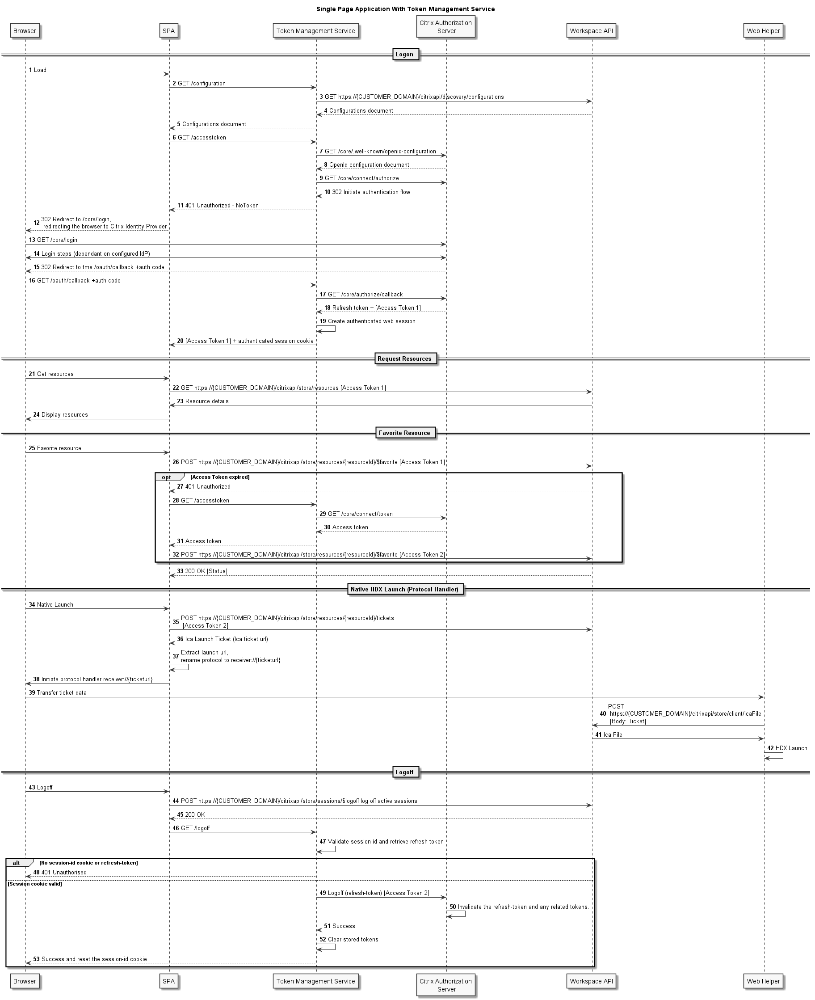

# Citrix(R) Unified Workspace API - Single Page Application (SPA) sample built with .Net Core and Javascript

This is a simple implementation of a Single Page Application (SPA) that shows how to interact with the Citrix(R) Unified Workspace APIs to build a functional web portal. It is a pure javascript implementation that is hosted by a C# ASP .NET server.

It uses the provided sample Token Management Service ([TMS](./Citrix.UnifiedApi.Test.TMS/README.md)) as its backend to handle OAuth tokens, and once it's received a token it will call the Workspace APIs.

This is purely an example and shouldn't be used for real production services.

## Sample site preview


## Prerequisites

- You have either a Private or Public Workspace OAuth Client
- You will be running the example code in Visual Studio and can run [.NET 7.0](https://dotnet.microsoft.com/en-us/download/dotnet/7.0)
- You have the [Citrix Workspace App](https://www.citrix.com/downloads/workspace-app/windows/workspace-app-for-windows-latest.html) installed

## Getting Started

### Run the provided sample Token Management Service (TMS)

To run this example, you must first be running the TMS. See the instructions [here](./Citrix.UnifiedApi.Test.TMS/README.md).

You will need to configure the TMS Frontend settings in the `appsettings.Development.json` as follows:

```json
"FrontEnd": {
    "FrontEndRedirectUrl": "https://localhost:7183/",
    "FrontEndCorsOrigin": "https://localhost:7183"
}
```

This is because the SPA is configured to run on `https://localhost:7183`.

### SPA

The SPA code assumes that you are running the TMS on `https://localhost:7182` and if you want to change that, you'll need to update the code in [app.js](./Citrix.UnifiedApi.Test.SPA/wwwroot/js/app.js) and [index.html](./Citrix.UnifiedApi.Test.SPA/wwwroot/index.html).

## Running the example

The C# server provides the backend and hosts the html and javascript files, and also provides endpoints for performing authorization. See [Token Management Service](../Citrix.UnifiedApi.Test.TMS/README.md) for details on how the flow occurs.

- Recommend using an Incognito browser to avoid cookie and cache causing problems.

Once started, you should be directed to the login page:


At this point, enter your customer.cloud.com address and click 'login'.

It should direct you to the standard login flow and after entering your login details it will take you to the home page:


Clicking on the resources should initiate a launch:


## SPA and Token Management Service Sequence Diagram

This sequence diagram illustrates the API calls the example Single Page Application (SPA) and the Token Management Service (TMS) will make during the initial page load, login, resource enumeration and resource launch.



## Javascript

The SPA frontend implementation uses simple javascript without any framework. For a more complicated application, implementers should consider using a framework such as Angular or React (see https://learn.microsoft.com/en-us/aspnet/core/client-side/spa/angular and https://learn.microsoft.com/en-us/aspnet/core/client-side/spa/react for info on integrating these frameworks with aspnet). This will also allow for proper package management of the javascript libraries.

The implementation retrieves the access token and stores it inside a private javascript closure. There are more secure alternatives involving web worker threads, or to simply have all token calls be handled by the backend (as in the Citrix.Unified.Api.Test.WebClient example).

## Javascript Libraries

The repo includes the following javascript libraries,

- Axios, https://axios-http.com/
- Handlebars, https://handlebarsjs.com/
- jQuery,  https://jquery.com/
- Semantic UI CSS, https://semantic-ui.com/

## License

Copyright © 2023. Cloud Software Group, Inc. All Rights Reserved.
